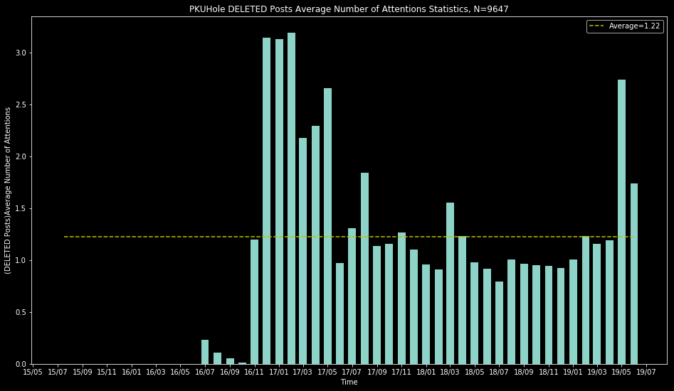
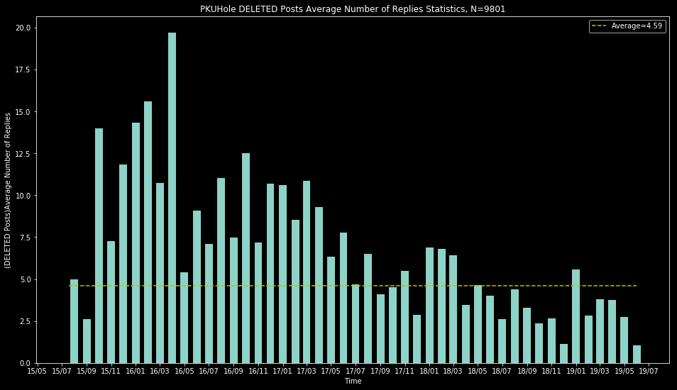

# **[查看被删树洞：](https://github.com/PKUDeleted/Holes/issues)**

**https://github.com/PKUDeleted/Holes/issues**

## 下面是一些树洞统计数据：
#### 使用时间：

可以看出大家最喜欢在23-24点，最**不**喜欢在5-6点刷树洞。
#### 树洞热度：

总体呈现线性增长。
#### 平均关注、回复数量：

树洞平均关注数量为1.62，平均回复数量为3.51。

虽然树洞热度逐年增长，每条树洞获得的关注和回复却有下降。
#### 被删树洞平均关注、回复数量：

被删树洞平均关注数量为1.22，低于总体平均。

被删树洞平均评论数量为4.59，高于总体平均值。
#### 删帖率：

2018前逐渐上升；2019年以来有所下降。

## 统计数据来源
https://github.com/martinwu42/pkuholebackup
