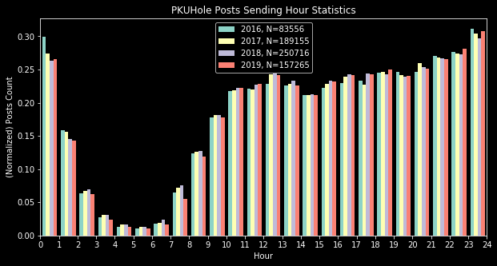
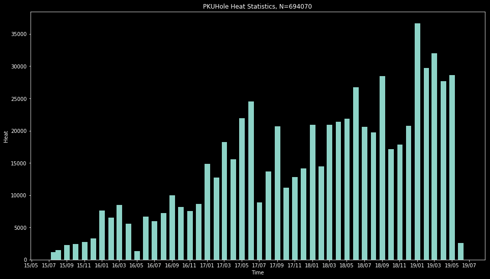
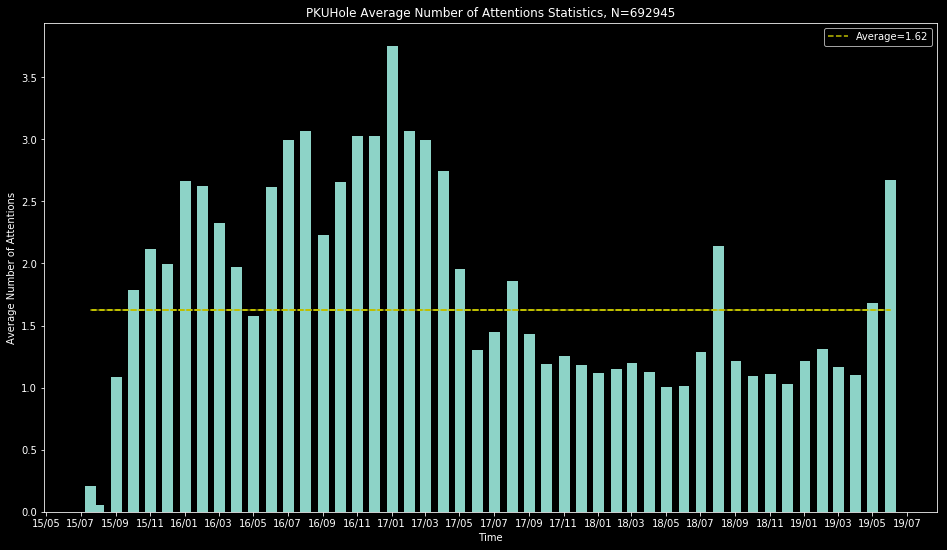
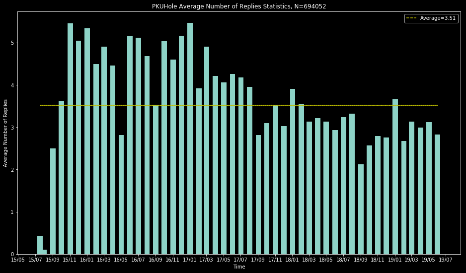
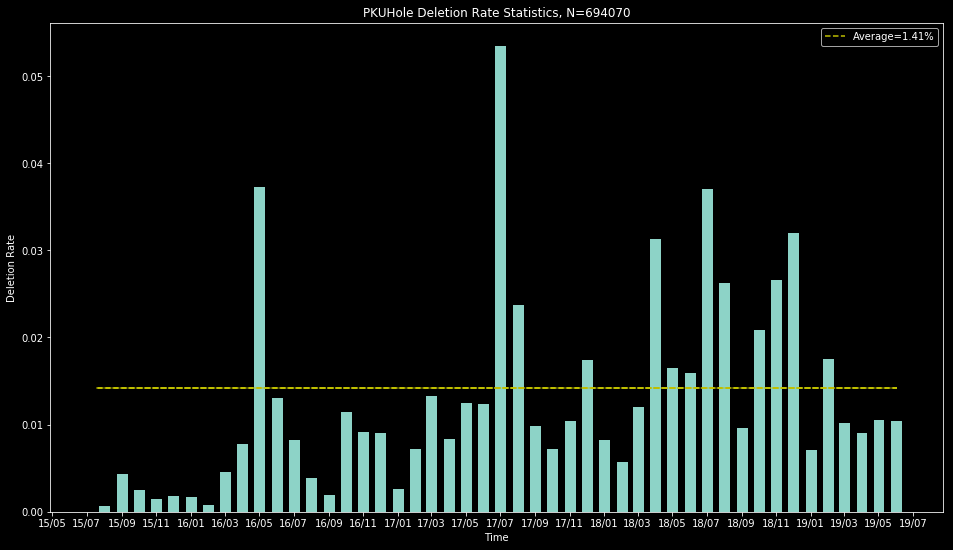

# **被删树洞请点击：👇**

**https://github.com/PKUDeleted/Holes/issues**

# 下面是一些树洞统计数据：
## 使用时间：

可以看出大家最喜欢在23-24点，最**不**喜欢在5-6点刷树洞。
## 树洞热度：

总体呈现线性增长。
## 关注、回复数量：

虽然树洞热度逐年增长，每条树洞获得的关注和回复却有下降。
# 删帖率

2018前逐渐上升；2019年以来有所下降。

# 统计数据来源
https://github.com/martinwu42/pkuholebackup
